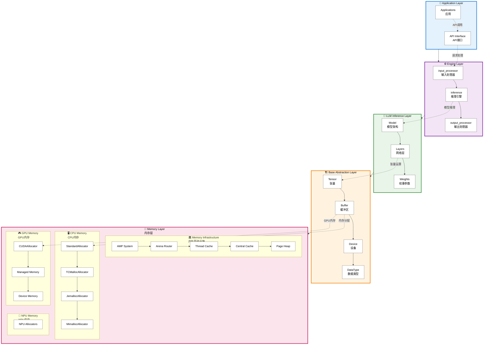

# NovaLLM Architecture Overview

## Architecture Diagram (积木式分层结构)



## Layer Descriptions

### 1. Application Layer
- **Purpose**: User-facing applications built on NovaLLM runtime
- **Components**:
  - Applications (chatbots, analysis tools, etc.)
  - API Interface (REST, gRPC, etc.)

### 2. Engine Layer
- **Purpose**: Core LLM processing orchestration
- **Components**:
  - **input_processor**: Tokenization, preprocessing
  - **inference**: Model execution and prediction
  - **output_processor**: Result formatting, post-processing

### 3. LLM Inference Layer
- **Purpose**: Neural network model execution
- **Components**:
  - **Model Layer**: Complete neural architecture
    - Network layers (attention, feedforward, etc.)
    - Model weights and parameters

### 4. Base Abstraction Layer
- **Purpose**: Fundamental data structures and abstractions
- **Components**:
  - **Tensor**: Multi-dimensional arrays for ML data
  - **Buffer**: Memory buffer management
  - **Device**: Hardware abstraction (CPU/GPU/NPU)
  - **DataType**: Numerical precision types

### 5. Memory Layer
- **Purpose**: Hardware-specific memory management
- **Components**:

  #### CPU Memory Allocators
  - **StandardAllocator**: Basic malloc/free
  - **TCMallocAllocator**: Google's high-performance allocator
  - **JemallocAllocator**: Facebook's scalable allocator
  - **MimallocAllocator**: Microsoft's modern allocator

  #### GPU Memory Allocators
  - **CUDAAllocator**: NVIDIA CUDA memory management
    - Regular device memory
    - Managed/unified memory

  #### NPU Memory Allocators
  - Specialized allocators for Neural Processing Units

  #### Memory Infrastructure (AMP System)
  - **Arena Router**: Device-specific memory routing
  - **Thread Cache**: Per-thread memory pools
  - **Central Cache**: Shared free lists
  - **Page Heap**: Large allocation handling

## Key Design Principles

1. **Layered Architecture**: Clear separation of concerns
2. **Hardware Abstraction**: Unified interface across CPU/GPU/NPU
3. **Memory Efficiency**: Advanced pooling and caching systems
4. **Extensibility**: Pluggable allocators and modular design
5. **Performance**: High-performance allocators with fallback mechanisms

## Data Flow

```
Application Request
       ↓
    Engine Layer (input → inference → output)
       ↓
  LLM Inference (model execution)
       ↓
Base Abstractions (Tensor, Buffer operations)
       ↓
  Memory Layer (hardware-specific allocation)
       ↓
Hardware Memory (CPU/GPU/NPU physical memory)
